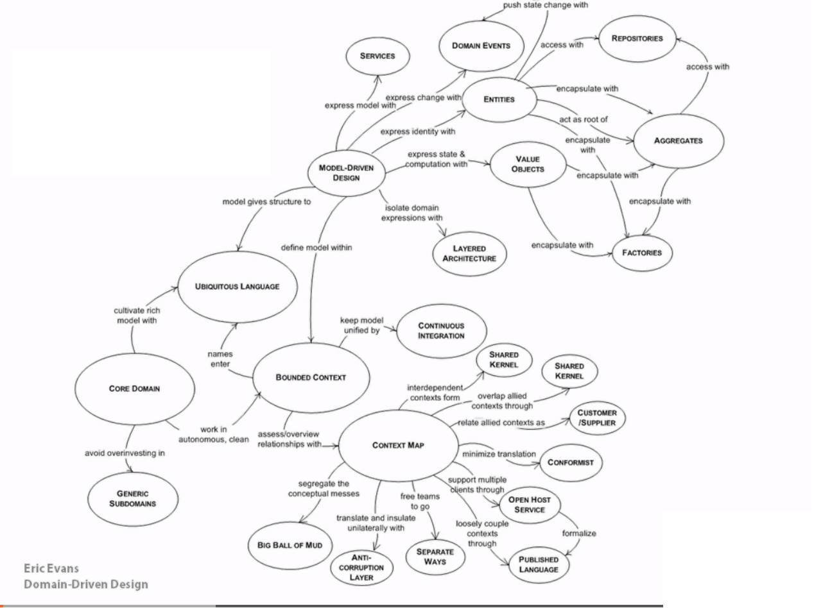

- [cqrsnu-tutorial](#cqrsnu-tutorial)
- [ddd example 2](#ddd-example-2)
- [When DDD is not a good idea](#when-ddd-is-not-a-good-idea)
- [DDD building blocks](#ddd-building-blocks)
  - [DDD Mind Map](#ddd-mind-map)
  - [Bounded context vs subdomain](#bounded-context-vs-subdomain)
  - [Anti-corruption layer](#anti-corruption-layer)
  - [Aggregate](#aggregate)
    - [Aggregate vs Aggregate Root](#aggregate-vs-aggregate-root)
  - [Value Object](#value-object)
  - [Entities](#entities)
- [resources](#resources)


# cqrsnu-tutorial
Tutorial based on http://cqrs.nu/tutorial/cs/01-design
https://github.com/edumentab/cqrs-starter-kit   

BDD tests:
GIVEN: events that happened
WHEN: command
THEN: events that should happen or expected exception

Questions:
1. where should be defined commands? In domain or outside?
Rather in application thx to this we can implement some aspects in application like 
handling transations. It is also ok to have application commands and domain commands.

2. aggregate should handle commands or rather it should have simple function like Activate()?
Aggregate can handle domain commands.

3. does it mean that command only produces events and Apply only updates the state?
YES.

4. apply function should not call exception because we cannot reject things the happened?
YES.

---
Aggregate should not have references to other agregates but we can inject to aggregate some domain service to
execute some operations.

Events should be defined in domain because domain triggers these events.

# ddd example 2

[ddd example 2](./ddd-example2)   
[readme](./ddd-example2/readme.md)

# When DDD is not a good idea

* when we have simple CRUD operation or data driven design
* when we are lacking domain expert ?
* when domain is simple

# DDD building blocks

## DDD Mind Map



## Bounded context vs subdomain

A **subdomain** is a part of your business. There are core domains, supporting domains and generic domains. Core domains are where the money is, supporting domains support your core business, and generic domains are the ones you need, but don't care a lot about, so you would probably buy them of the shelf. For an insurance company, the core domain is insurance, a supporting domain could be client portfolio, and a generic domain could be something like timesheets.

When both subdomains and the core domain are defined, it’s time to implement the code. **Bounded context** defines tangible boundaries of **applicability of some subdomain** (so in practice it is created source code?).
It seems natural that the code belonging to some bounded context would implement a single subdomain, the one it was intended for, having no clue about the others. But this alignment is not always a case, of course. The most frequent reason is some legacy system that was built without a DDD approach in mind. Bounded contexts in such systems can expose several subdomains.  

Example:
One subdomain represents a transaction processing logic, and the other, transaction reconciliation logic. So the following code represents these two sub-domains within a single bounded context:

```
class Gateway
{
    public function go()

    {
        $this-&gt;processPayment();
        $this-&gt;processReconciliation();
    }

    private function processPayment()
    {

        // do some stuff here
    }


    private function processReconciliation()
    {
        // do some stuff here

    }
}
```

> "Sub-domain is a problem space concept and bounded context is a solution space concept".

> "Sub-domain is a way we chose to break up a business and bounded context describes how the software and the software development has been broken down."

> "Sub-domains are separate applications of features your software must support or interact with. Bounded context is a specific responsibility, with explicit boundaries that separate it from other parts of the system."

## Anti-corruption layer
Used to communicate between different subdomains.

## Aggregate

An aggregate is an encapsulation of entities and value objects (domain objects) which conceptually belong together. It also contains a set of operations which those domain objects can be operated on. 

> "Aggregates are the basic element of transfer of data storage — you request to load or save whole aggregates. Transactions should not cross aggregate boundaries."

Sample aggregate
```
public class Car
{
    public Engine Engine { get; private set; }
    private List<Wheel> _wheels;
    public IReadOnlyList<Wheel> Wheels => _wheels;
    public string BodyColour { get; private set; }
    private List<Light> _lights;
    public IReadOnlyList<Light> Lights => _lights;
    public bool IsShipped { get; private set; }
    public Car(List<Light> lights, List<Wheel> wheels, string bodyColour, Engine engine, bool isShipped)
    {
        _lights = lights;
        _wheels = wheels;
        BodyColour = bodyColour;
        Engine = engine;
        IsShipped = isShipped;
    }
    public void PaintBody(string colour)
    {
        if (colour == "yellow")
        {
            throw new ArgumentException("No yellow cars are allowed");
        }
        if (_lights.Count > 0)
        {
            throw new ArgumentException("Some lights are already installed");
        }
        BodyColour = colour;
    }
    
    public void InstallLight()
    {
        if (_lights.Count == 16)
        {
            throw new ArgumentException("Lights are fully installed");
        }
        if (BodyColour != null)
        {
            throw new ArgumentException("Body is already painted");
        }
    }
    public void InstallEngine(Engine engine)
    {
        Engine = engine;
    }
    public void InstallWheel(Wheel wheel)
    {
        if (_wheels.Count == 4)
        {
            throw new ArgumentException("Wheels are already fully installed");
        }
        _wheels.Add(wheel);
     }
     public void Ship()
     {
        if (_wheels.Count != 4)
        {
            throw new ArgumentException("Wheels are not fully installed yet");
        }
        if (_lights.Count != 16)
        {
            throw new ArgumentException("Lights are not fully installed yet");
        }
        if (Engine == null)
        {
            throw new ArgumentException("Engine is not installed yet");
        }
        if (BodyColour == null)
        {
            throw new ArgumentException("Body is not painted yet");
        }
        IsShipped = true;
    }
}
```

### Aggregate vs Aggregate Root

An AGGREGATE is a cluster of associated objects that we treat as a **unit for the purpose of data changes**. Each AGGREGATE has a root and a boundary. The boundary defines what is inside the AGGREGATE. The root is a single, specific ENTITY contained in the AGGREGATE.

Aggregate roots are the only objects that can be loaded from a repository.

An example is a model containing a Customer entity and an Address entity. We would never access an Address entity directly from the model as it does not make sense without the context of an associated Customer. So we could say that Customer and Address together form an aggregate and that Customer is an aggregate root.

> "An aggregate will have one of its component objects be the aggregate root. Any references from outside the aggregate should only go to the aggregate root. The root can thus ensure the integrity of the aggregate as a whole."

## Value Object

A Value Object is an immutable type that is distinguishable only by the state of its properties. That is, unlike an Entity, which has a unique identifier and remains distinct even if its properties are otherwise identical, two Value Objects with the exact same properties can be considered equal.

Being immutable, Value Objects cannot be changed once they are created. Modifying one is conceptually the same as discarding the old one and creating a new one.

A value object:

* does not have an identity
* must be immutable

Sample value object:
```
public abstract class ValueObject
{
    protected static bool EqualOperator(ValueObject left, ValueObject right)
    {
        if (ReferenceEquals(left, null) ^ ReferenceEquals(right, null))
        {
            return false;
        }
        return ReferenceEquals(left, null) || left.Equals(right);
    }

    protected static bool NotEqualOperator(ValueObject left, ValueObject right)
    {
        return !(EqualOperator(left, right));
    }

    protected abstract IEnumerable<object> GetEqualityComponents();

    public override bool Equals(object obj)
    {
        if (obj == null || obj.GetType() != GetType())
        {
            return false;
        }

        var other = (ValueObject)obj;

        return this.GetEqualityComponents().SequenceEqual(other.GetEqualityComponents());
    }

    public override int GetHashCode()
    {
        return GetEqualityComponents()
            .Select(x => x != null ? x.GetHashCode() : 0)
            .Aggregate((x, y) => x ^ y);
    }
    // Other utility methods
}
```

Concrete class:
```
public class Address : ValueObject
{
    public String Street { get; private set; }
    public String City { get; private set; }
    public String State { get; private set; }
    public String Country { get; private set; }
    public String ZipCode { get; private set; }

    public Address() { }

    public Address(string street, string city, string state, string country, string zipcode)
    {
        Street = street;
        City = city;
        State = state;
        Country = country;
        ZipCode = zipcode;
    }

    protected override IEnumerable<object> GetEqualityComponents()
    {
        // Using a yield return statement to return each element one at a time
        yield return Street;
        yield return City;
        yield return State;
        yield return Country;
        yield return ZipCode;
    }
}
```

## Entities

If two instances of the same object have different attribute values, but same identity value, are they the same entity?
If the answer is “yes”, and I care about an identity, then the class is indeed an entity.

An entity:

* has an identity
* contains value objects
* may contain other entities
* can be mutable

Sample entity:
```
public class Customer
{
    public Guid Id { get; }

    public Name Name { get; }

    public Email Email { get; }

    public Customer(Guid id, Name name, Email email)
    {
        if (id == Guid.Empty) throw new Exception("Id is invalid");
        if (name == null) throw new Exception("Name is required");
        if (email == null) throw new Exception("Email is required");

        Id = id;
        Name = name;
        Email = email;
    }
}
```

# resources

https://medium.com/ingeniouslysimple/aggregates-in-domain-driven-design-5aab3ef9901d   
https://deviq.com/domain-driven-design/value-object   
https://docs.microsoft.com/en-us/dotnet/architecture/microservices/microservice-ddd-cqrs-patterns/implement-value-objects   
https://stackoverflow.com/questions/1958621/whats-an-aggregate-root#:~:text=An%20AGGREGATE%20is%20a%20cluster,ENTITY%20contained%20in%20the%20AGGREGATE   
https://app.pluralsight.com/library/courses/domain-driven-design-fundamentals/exercise-files   
https://medium.com/nick-tune-tech-strategy-blog/domains-subdomain-problem-solution-space-in-ddd-clearly-defined-e0b49c7b586c   
https://dzone.com/articles/ddd-strategic-patterns-how-to-define-bounded-conte   